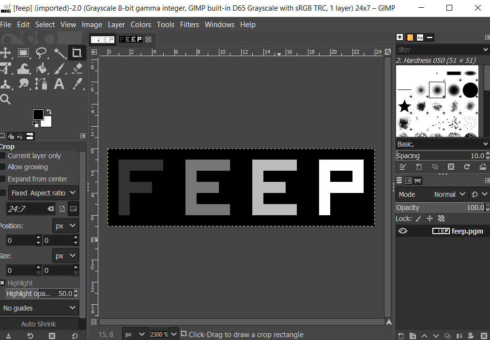
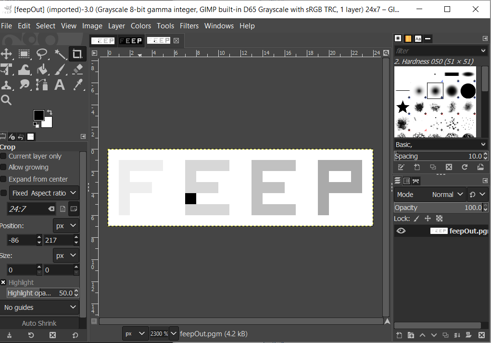

# image_converter

An image converter written in [MIPS assembly](http://courses.missouristate.edu/kenvollmar/mars/). 

## Features

- read the image from a file
- set_pixel and get_pixel
- invert the image
- rescale the image
- write the image to the file

## Description

- image before conversion:



- image after conversion:



## Notice

```
Please do not copy any code from this repository for academic purposes.
```